# Dependency graph

Intra-ecosystem dependencies derived from each repo's `sml.pkg` `require {}` block. Generated by `scripts/depgraph.py`; do not edit by hand.

262 edges across 288 libraries.

```mermaid
graph LR
  sml_aead[sml-aead] --> sml_aes[sml-aes]
  sml_aead[sml-aead] --> sml_chacha20[sml-chacha20]
  sml_annealing[sml-annealing] --> sml_prng[sml-prng]
  sml_argumentation[sml-argumentation] --> sml_sat[sml-sat]
  sml_asn1[sml-asn1] --> sml_bigint[sml-bigint]
  sml_astar[sml-astar] --> sml_pqueue[sml-pqueue]
  sml_astro[sml-astro] --> sml_datetime[sml-datetime]
  sml_base58[sml-base58] --> sml_codec[sml-codec]
  sml_bip32[sml-bip32] --> sml_base58[sml-base58]
  sml_bip32[sml-bip32] --> sml_bigint[sml-bigint]
  sml_bip32[sml-bip32] --> sml_bip39[sml-bip39]
  sml_bip32[sml-bip32] --> sml_codec[sml-codec]
  sml_bip32[sml-bip32] --> sml_crypto[sml-crypto]
  sml_bip32[sml-bip32] --> sml_ripemd160[sml-ripemd160]
  sml_bip32[sml-bip32] --> sml_secp256k1[sml-secp256k1]
  sml_bip39[sml-bip39] --> sml_codec[sml-codec]
  sml_bip39[sml-bip39] --> sml_crypto[sml-crypto]
  sml_bloom[sml-bloom] --> sml_bitset[sml-bitset]
  sml_bloom[sml-bloom] --> sml_codec[sml-codec]
  sml_bm25[sml-bm25] --> sml_invertedindex[sml-invertedindex]
  sml_camera[sml-camera] --> sml_glm[sml-glm]
  sml_canvas2d[sml-canvas2d] --> sml_color[sml-color]
  sml_canvas2d[sml-canvas2d] --> sml_image[sml-image]
  sml_canvas2d[sml-canvas2d] --> sml_inflate[sml-inflate]
  sml_canvas2d[sml-canvas2d] --> sml_pretty[sml-pretty]
  sml_canvas2d[sml-canvas2d] --> sml_raster[sml-raster]
  sml_canvas2d[sml-canvas2d] --> sml_svg[sml-svg]
  sml_check[sml-check] --> sml_prng[sml-prng]
  sml_check[sml-check] --> sml_test[sml-test]
  sml_chem[sml-chem] --> sml_matrix[sml-matrix]
  sml_circuit[sml-circuit] --> sml_prng[sml-prng]
  sml_cluster[sml-cluster] --> sml_prng[sml-prng]
  sml_collision[sml-collision] --> sml_glm[sml-glm]
  sml_colorsci[sml-colorsci] --> sml_color[sml-color]
  sml_consistenthash[sml-consistenthash] --> sml_codec[sml-codec]
  sml_constants[sml-constants] --> sml_units[sml-units]
  sml_cookie[sml-cookie] --> sml_crypto[sml-crypto]
  sml_cookie[sml-cookie] --> sml_datetime[sml-datetime]
  sml_cookie[sml-cookie] --> sml_http[sml-http]
  sml_cose[sml-cose] --> sml_cbor[sml-cbor]
  sml_crdt[sml-crdt] --> sml_test[sml-test]
  sml_cron[sml-cron] --> sml_datetime[sml-datetime]
  sml_crypto[sml-crypto] --> sml_codec[sml-codec]
  sml_csp[sml-csp] --> sml_async[sml-async]
  sml_deflate[sml-deflate] --> sml_codec[sml-codec]
  sml_dns_resolve[sml-dns-resolve] --> sml_dns[sml-dns]
  sml_dns_resolve[sml-dns-resolve] --> sml_lru[sml-lru]
  sml_dsp[sml-dsp] --> sml_complex[sml-complex]
  sml_dsp[sml-dsp] --> sml_fft[sml-fft]
  sml_editorcore[sml-editorcore] --> sml_unicode[sml-unicode]
  sml_elab[sml-elab] --> sml_mlast[sml-mlast]
  sml_feed[sml-feed] --> sml_datetime[sml-datetime]
  sml_feed[sml-feed] --> sml_xml[sml-xml]
  sml_fft[sml-fft] --> sml_complex[sml-complex]
  sml_fmt[sml-fmt] --> sml_mlast[sml-mlast]
  sml_fol[sml-fol] --> sml_rewrite[sml-rewrite]
  sml_font[sml-font] --> sml_image[sml-image]
  sml_font[sml-font] --> sml_raster[sml-raster]
  sml_forms[sml-forms] --> sml_json[sml-json]
  sml_forms[sml-forms] --> sml_uri[sml-uri]
  sml_ga[sml-ga] --> sml_prng[sml-prng]
  sml_geo[sml-geo] --> sml_json[sml-json]
  sml_geom2d[sml-geom2d] --> sml_glm[sml-glm]
  sml_gif[sml-gif] --> sml_image[sml-image]
  sml_git[sml-git] --> sml_deflate[sml-deflate]
  sml_gossip[sml-gossip] --> sml_prng[sml-prng]
  sml_graph[sml-graph] --> sml_pqueue[sml-pqueue]
  sml_graphql[sml-graphql] --> sml_json[sml-json]
  sml_graphql[sml-graphql] --> sml_parsec[sml-parsec]
  sml_gzip[sml-gzip] --> sml_codec[sml-codec]
  sml_gzip[sml-gzip] --> sml_deflate[sml-deflate]
  sml_gzip[sml-gzip] --> sml_inflate[sml-inflate]
  sml_hm[sml-hm] --> sml_lambda[sml-lambda]
  sml_hmm[sml-hmm] --> sml_matrix[sml-matrix]
  sml_html[sml-html] --> sml_buffer[sml-buffer]
  sml_http[sml-http] --> sml_uri[sml-uri]
  sml_httpc[sml-httpc] --> sml_http[sml-http]
  sml_httpc[sml-httpc] --> sml_uri[sml-uri]
  sml_httpc_tool[sml-httpc-tool] --> sml_http[sml-http]
  sml_httpc_tool[sml-httpc-tool] --> sml_httpc[sml-httpc]
  sml_httpc_tool[sml-httpc-tool] --> sml_uri[sml-uri]
  sml_image[sml-image] --> sml_color[sml-color]
  sml_image[sml-image] --> sml_inflate[sml-inflate]
  sml_json[sml-json] --> sml_parsec[sml-parsec]
  sml_jsonpath[sml-jsonpath] --> sml_json[sml-json]
  sml_jwt[sml-jwt] --> sml_codec[sml-codec]
  sml_jwt[sml-jwt] --> sml_crypto[sml-crypto]
  sml_jwt[sml-jwt] --> sml_json[sml-json]
  sml_kalman[sml-kalman] --> sml_matrix[sml-matrix]
  sml_kdf[sml-kdf] --> sml_codec[sml-codec]
  sml_kdf[sml-kdf] --> sml_crypto[sml-crypto]
  sml_knn[sml-knn] --> sml_kdtree[sml-kdtree]
  sml_lint[sml-lint] --> sml_mlast[sml-mlast]
  sml_lsp[sml-lsp] --> sml_fmt[sml-fmt]
  sml_lsp[sml-lsp] --> sml_json[sml-json]
  sml_lsp[sml-lsp] --> sml_mlast[sml-mlast]
  sml_markdown[sml-markdown] --> sml_html[sml-html]
  sml_markov[sml-markov] --> sml_matrix[sml-matrix]
  sml_markov[sml-markov] --> sml_prng[sml-prng]
  sml_mcmc[sml-mcmc] --> sml_prng[sml-prng]
  sml_mcmc[sml-mcmc] --> sml_stats[sml-stats]
  sml_middleware[sml-middleware] --> sml_glob[sml-glob]
  sml_middleware[sml-middleware] --> sml_http[sml-http]
  sml_mime[sml-mime] --> sml_http[sml-http]
  sml_mincostflow[sml-mincostflow] --> sml_graph[sml-graph]
  sml_minikanren[sml-minikanren] --> sml_stream[sml-stream]
  sml_modal[sml-modal] --> sml_logic[sml-logic]
  sml_modelcheck[sml-modelcheck] --> sml_bdd[sml-bdd]
  sml_money[sml-money] --> sml_bigdecimal[sml-bigdecimal]
  sml_montecarlo[sml-montecarlo] --> sml_prng[sml-prng]
  sml_nbody[sml-nbody] --> sml_glm[sml-glm]
  sml_negotiate[sml-negotiate] --> sml_http[sml-http]
  sml_nn[sml-nn] --> sml_autodiff[sml-autodiff]
  sml_nn[sml-nn] --> sml_tensor[sml-tensor]
  sml_noise[sml-noise] --> sml_glm[sml-glm]
  sml_noise[sml-noise] --> sml_prng[sml-prng]
  sml_numbertheory[sml-numbertheory] --> sml_bigint[sml-bigint]
  sml_oauth[sml-oauth] --> sml_codec[sml-codec]
  sml_oauth[sml-oauth] --> sml_json[sml-json]
  sml_oauth[sml-oauth] --> sml_random[sml-random]
  sml_oauth[sml-oauth] --> sml_uri[sml-uri]
  sml_obj[sml-obj] --> sml_glm[sml-glm]
  sml_openapi[sml-openapi] --> sml_json[sml-json]
  sml_openapi[sml-openapi] --> sml_yaml[sml-yaml]
  sml_pager[sml-pager] --> sml_lru[sml-lru]
  sml_pca[sml-pca] --> sml_matrix[sml-matrix]
  sml_pde[sml-pde] --> sml_matrix[sml-matrix]
  sml_pdf[sml-pdf] --> sml_codec[sml-codec]
  sml_pdf[sml-pdf] --> sml_deflate[sml-deflate]
  sml_pem[sml-pem] --> sml_codec[sml-codec]
  sml_physics[sml-physics] --> sml_glm[sml-glm]
  sml_pkg[sml-pkg] --> sml_cli[sml-cli]
  sml_plot[sml-plot] --> sml_color[sml-color]
  sml_plot[sml-plot] --> sml_font[sml-font]
  sml_plot[sml-plot] --> sml_image[sml-image]
  sml_plot[sml-plot] --> sml_raster[sml-raster]
  sml_proof[sml-proof] --> sml_logic[sml-logic]
  sml_protobuf[sml-protobuf] --> sml_varint[sml-varint]
  sml_qoi[sml-qoi] --> sml_image[sml-image]
  sml_qrcode[sml-qrcode] --> sml_image[sml-image]
  sml_qrcode[sml-qrcode] --> sml_raster[sml-raster]
  sml_raft[sml-raft] --> sml_prng[sml-prng]
  sml_raster[sml-raster] --> sml_image[sml-image]
  sml_redis[sml-redis] --> sml_buffer[sml-buffer]
  sml_roguelike[sml-roguelike] --> sml_astar[sml-astar]
  sml_roguelike[sml-roguelike] --> sml_pqueue[sml-pqueue]
  sml_router[sml-router] --> sml_http[sml-http]
  sml_router[sml-router] --> sml_uri[sml-uri]
  sml_rsa[sml-rsa] --> sml_asn1[sml-asn1]
  sml_rsa[sml-rsa] --> sml_bigint[sml-bigint]
  sml_rsa[sml-rsa] --> sml_codec[sml-codec]
  sml_rsa[sml-rsa] --> sml_pem[sml-pem]
  sml_sanitize[sml-sanitize] --> sml_html[sml-html]
  sml_schema[sml-schema] --> sml_json[sml-json]
  sml_schema[sml-schema] --> sml_rederiv[sml-rederiv]
  sml_score[sml-score] --> sml_midi[sml-midi]
  sml_score[sml-score] --> sml_music[sml-music]
  sml_secp256k1[sml-secp256k1] --> sml_codec[sml-codec]
  sml_secp256k1[sml-secp256k1] --> sml_crypto[sml-crypto]
  sml_semver[sml-semver] --> sml_parsec[sml-parsec]
  sml_sequencer[sml-sequencer] --> sml_midi[sml-midi]
  sml_sequencer[sml-sequencer] --> sml_music[sml-music]
  sml_sequent[sml-sequent] --> sml_logic[sml-logic]
  sml_serve[sml-serve] --> sml_async[sml-async]
  sml_serve[sml-serve] --> sml_web[sml-web]
  sml_session[sml-session] --> sml_cookie[sml-cookie]
  sml_session[sml-session] --> sml_json[sml-json]
  sml_session[sml-session] --> sml_random[sml-random]
  sml_sexp[sml-sexp] --> sml_parsec[sml-parsec]
  sml_skiplist[sml-skiplist] --> sml_prng[sml-prng]
  sml_smt[sml-smt] --> sml_sat[sml-sat]
  sml_smtp[sml-smtp] --> sml_codec[sml-codec]
  sml_smtp[sml-smtp] --> sml_mime[sml-mime]
  sml_ssg[sml-ssg] --> sml_markdown[sml-markdown]
  sml_ssg[sml-ssg] --> sml_template[sml-template]
  sml_stats[sml-stats] --> sml_prng[sml-prng]
  sml_stats[sml-stats] --> sml_specfun[sml-specfun]
  sml_stlc[sml-stlc] --> sml_proof[sml-proof]
  sml_stlc[sml-stlc] --> sml_rewrite[sml-rewrite]
  sml_svg[sml-svg] --> sml_pretty[sml-pretty]
  sml_synth[sml-synth] --> sml_complex[sml-complex]
  sml_synth[sml-synth] --> sml_fft[sml-fft]
  sml_synth[sml-synth] --> sml_wav[sml-wav]
  sml_tea[sml-tea] --> sml_buffer[sml-buffer]
  sml_tea[sml-tea] --> sml_css[sml-css]
  sml_tea[sml-tea] --> sml_html[sml-html]
  sml_tea[sml-tea] --> sml_signal[sml-signal]
  sml_tea[sml-tea] --> sml_vdom[sml-vdom]
  sml_template[sml-template] --> sml_html[sml-html]
  sml_text_layout[sml-text-layout] --> sml_color[sml-color]
  sml_text_layout[sml-text-layout] --> sml_font[sml-font]
  sml_text_layout[sml-text-layout] --> sml_image[sml-image]
  sml_text_layout[sml-text-layout] --> sml_inflate[sml-inflate]
  sml_text_layout[sml-text-layout] --> sml_raster[sml-raster]
  sml_text_layout[sml-text-layout] --> sml_unicode[sml-unicode]
  sml_tls[sml-tls] --> sml_aead[sml-aead]
  sml_tls[sml-tls] --> sml_codec[sml-codec]
  sml_tls[sml-tls] --> sml_kdf[sml-kdf]
  sml_tls[sml-tls] --> sml_rsa[sml-rsa]
  sml_tls[sml-tls] --> sml_x25519[sml-x25519]
  sml_tls[sml-tls] --> sml_x509[sml-x509]
  sml_tls_tool[sml-tls-tool] --> sml_tls[sml-tls]
  sml_toml[sml-toml] --> sml_parsec[sml-parsec]
  sml_totp[sml-totp] --> sml_base32[sml-base32]
  sml_totp[sml-totp] --> sml_codec[sml-codec]
  sml_totp[sml-totp] --> sml_crypto[sml-crypto]
  sml_trace[sml-trace] --> sml_json[sml-json]
  sml_trace[sml-trace] --> sml_prng[sml-prng]
  sml_treap[sml-treap] --> sml_prng[sml-prng]
  sml_ui[sml-ui] --> sml_canvas2d[sml-canvas2d]
  sml_ui[sml-ui] --> sml_color[sml-color]
  sml_ui[sml-ui] --> sml_font[sml-font]
  sml_ui[sml-ui] --> sml_image[sml-image]
  sml_ui[sml-ui] --> sml_inflate[sml-inflate]
  sml_ui[sml-ui] --> sml_layout[sml-layout]
  sml_ui[sml-ui] --> sml_pretty[sml-pretty]
  sml_ui[sml-ui] --> sml_raster[sml-raster]
  sml_ui[sml-ui] --> sml_signal[sml-signal]
  sml_ui[sml-ui] --> sml_svg[sml-svg]
  sml_ui[sml-ui] --> sml_text_layout[sml-text-layout]
  sml_ui[sml-ui] --> sml_unicode[sml-unicode]
  sml_vdom[sml-vdom] --> sml_buffer[sml-buffer]
  sml_vdom[sml-vdom] --> sml_html[sml-html]
  sml_wav[sml-wav] --> sml_complex[sml-complex]
  sml_wav[sml-wav] --> sml_fft[sml-fft]
  sml_web[sml-web] --> sml_forms[sml-forms]
  sml_web[sml-web] --> sml_html[sml-html]
  sml_web[sml-web] --> sml_http[sml-http]
  sml_web[sml-web] --> sml_middleware[sml-middleware]
  sml_web[sml-web] --> sml_negotiate[sml-negotiate]
  sml_web[sml-web] --> sml_router[sml-router]
  sml_web[sml-web] --> sml_session[sml-session]
  sml_window[sml-window] --> sml_canvas2d[sml-canvas2d]
  sml_window[sml-window] --> sml_color[sml-color]
  sml_window[sml-window] --> sml_font[sml-font]
  sml_window[sml-window] --> sml_image[sml-image]
  sml_window[sml-window] --> sml_inflate[sml-inflate]
  sml_window[sml-window] --> sml_layout[sml-layout]
  sml_window[sml-window] --> sml_pretty[sml-pretty]
  sml_window[sml-window] --> sml_raster[sml-raster]
  sml_window[sml-window] --> sml_signal[sml-signal]
  sml_window[sml-window] --> sml_svg[sml-svg]
  sml_window[sml-window] --> sml_text_layout[sml-text-layout]
  sml_window[sml-window] --> sml_ui[sml-ui]
  sml_window[sml-window] --> sml_unicode[sml-unicode]
  sml_wkt[sml-wkt] --> sml_geo[sml-geo]
  sml_ws[sml-ws] --> sml_codec[sml-codec]
  sml_ws[sml-ws] --> sml_http[sml-http]
  sml_x509[sml-x509] --> sml_asn1[sml-asn1]
  sml_x509[sml-x509] --> sml_bigint[sml-bigint]
  sml_x509[sml-x509] --> sml_codec[sml-codec]
  sml_x509[sml-x509] --> sml_pem[sml-pem]
  sml_x509[sml-x509] --> sml_rsa[sml-rsa]
  sml_xlsx[sml-xlsx] --> sml_codec[sml-codec]
  sml_xlsx[sml-xlsx] --> sml_deflate[sml-deflate]
  sml_xlsx[sml-xlsx] --> sml_unicode[sml-unicode]
  sml_xlsx[sml-xlsx] --> sml_xml[sml-xml]
  sml_xlsx[sml-xlsx] --> sml_zip[sml-zip]
  sml_xml[sml-xml] --> sml_unicode[sml-unicode]
  sml_yaml[sml-yaml] --> sml_parsec[sml-parsec]
  sml_zip[sml-zip] --> sml_codec[sml-codec]
  sml_zip[sml-zip] --> sml_deflate[sml-deflate]
```

> Note: 2 repo(s) had no readable `sml.pkg` and were skipped: `awesome-standard-ml`, `sml-doc`.
